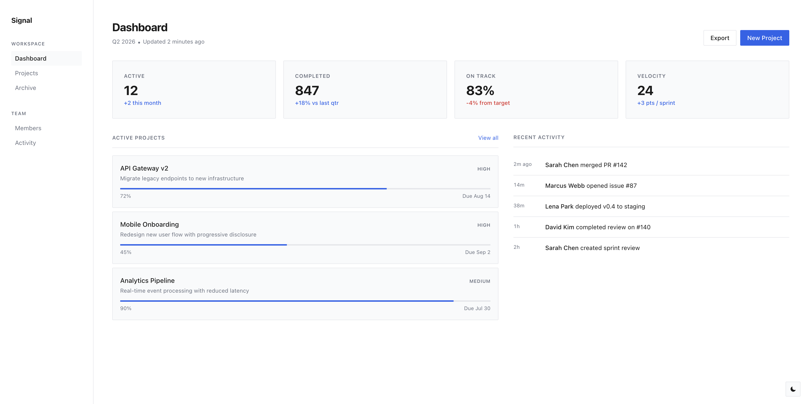
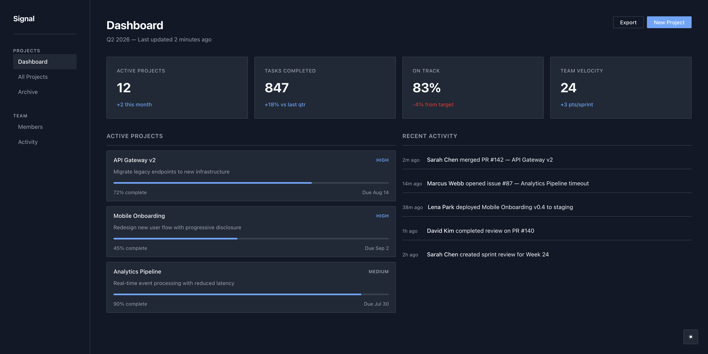
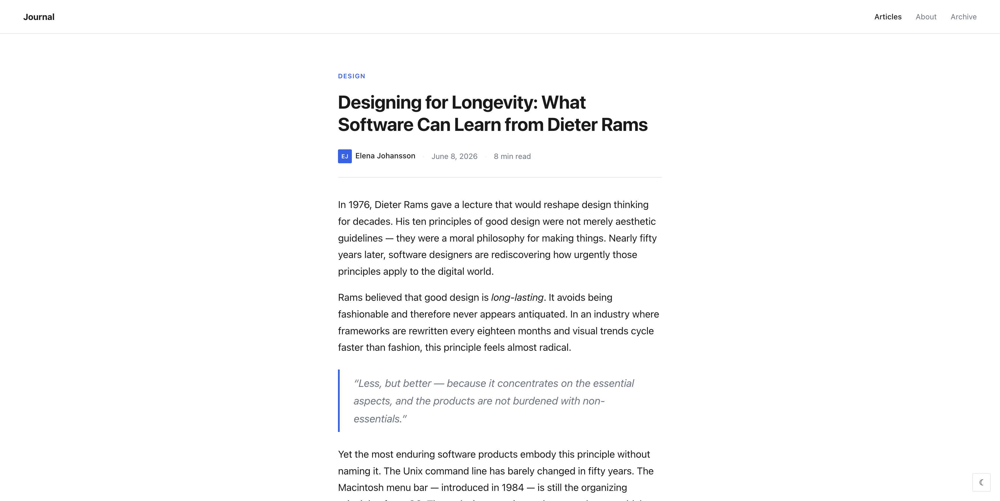
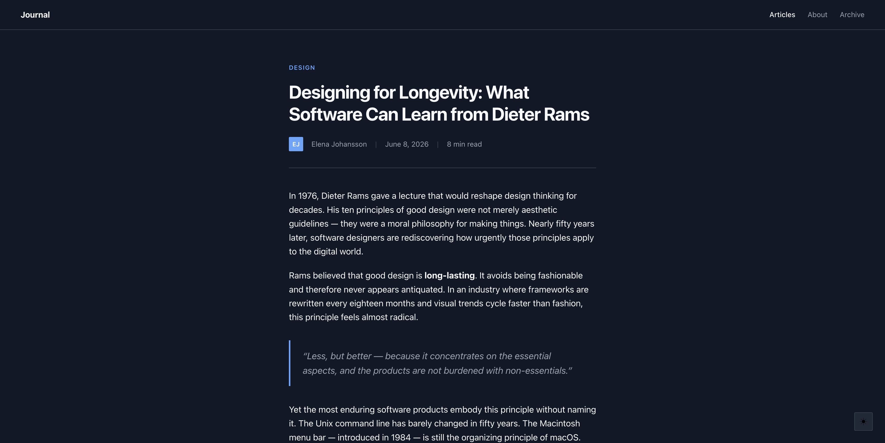
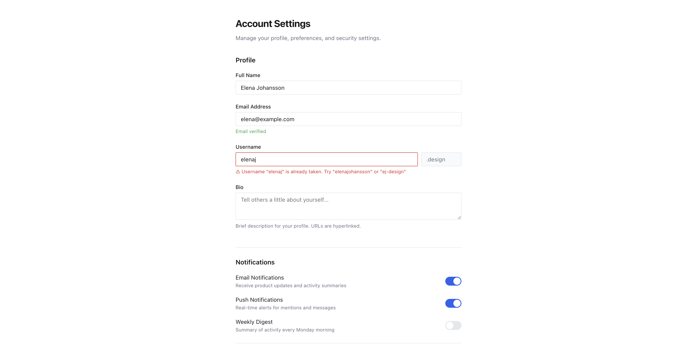
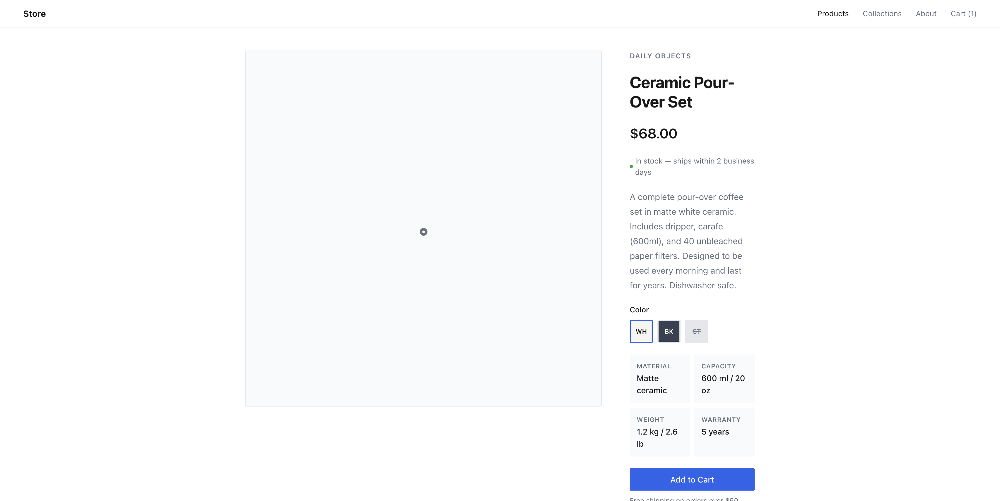
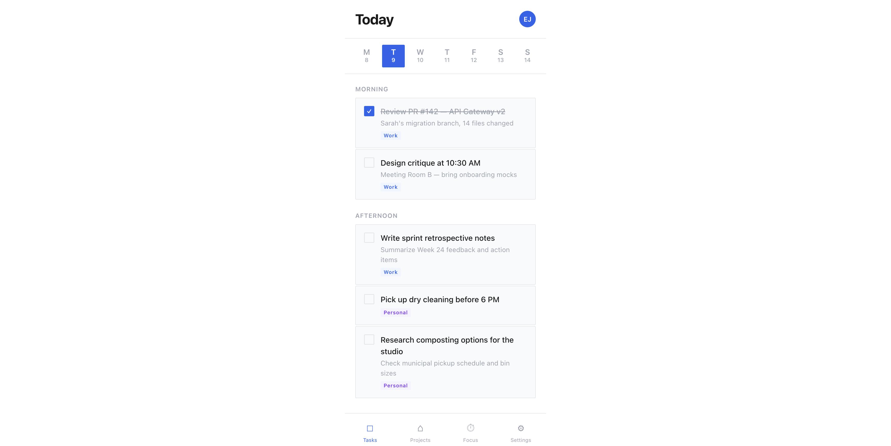
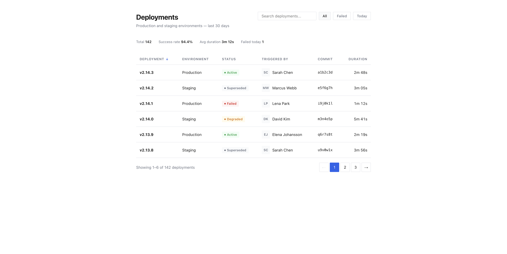
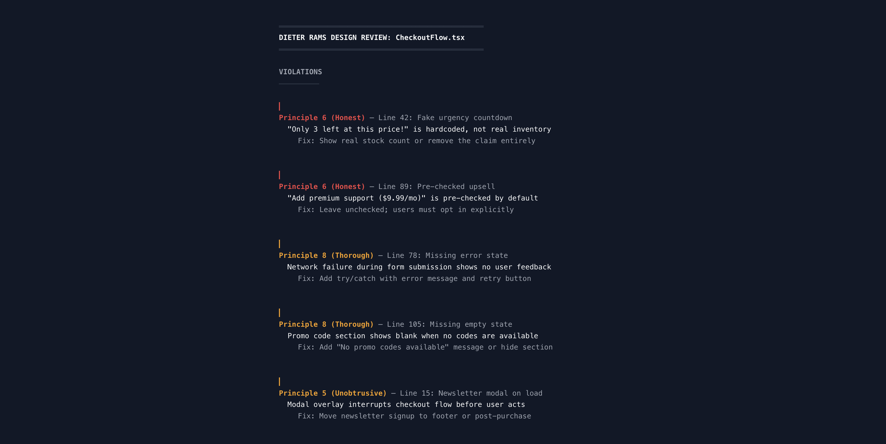

# dieter-rams-design-skill

[](LICENSE)
[](https://github.com/anomalyco/opencode)
[](https://claude.ai)
[](https://www.vitsoe.com/gb/about/good-design)

> **An AI skill that turns Dieter Rams' 10 principles of good design into actionable software design rules.** Create interfaces that are useful, honest, unobtrusive, and built to last — or audit existing ones against the standard that defined Braun and Vitsoe.
>
> *"Less, but better"* — Dieter Rams

## What it does

When triggered, this skill instructs the AI agent to produce and review software interfaces following Rams' ten principles:

1. **Innovative** — Solve real problems in new ways; don't chase novelty for its own sake
2. **Useful** — Every UI element must serve a user need; remove everything that doesn't
3. **Aesthetic** — Beauty through harmony, proportion, and clarity — not decoration
4. **Understandable** — Self-explanatory interfaces; the user intuits function without instruction
5. **Unobtrusive** — The interface is a tool, not a monument; it recedes during use
6. **Honest** — No dark patterns, fake scarcity, or manipulative UX; show real data
7. **Long-lasting** — Avoid trends; use timeless patterns that won't feel dated in 5 years
8. **Thorough** — Design every state: loading, empty, error, disabled, focus — nothing left to chance
9. **Environmentally friendly** — Performance as ethics; minimize resource consumption throughout
10. **As little design as possible** — Less, but better. Delete before adding. Every line must earn its place

## Examples

All outputs below were generated by applying this skill to produce Rams-inspired interfaces.

### Dashboard (light)

Clean project management dashboard: 4-column metric cards, active project list with progress bars, recent activity feed. Monochromatic base palette with single blue accent, system typography, no gradients or shadows.



### Dashboard (dark)

Same structure in dark mode. Background/text colors swapped, accent saturation adjusted. Nothing else changes — honest design doesn't need a different visual language for dark mode.



### Editorial layout (light)

Long-form article with pull quotes, blockquotes, and footnotes. Single-column content, maximized for readability (680px max-width), content-first design with minimal chrome.



### Editorial layout (dark)

Same article in dark mode. The interface recedes — content remains the focus regardless of color scheme.



### Account settings form

Complete form with all component states: default fields (filled and empty), validation error with helpful message, disabled inputs, toggle switches, and a danger zone with destructive action. Thorough down to the last detail (Principle 8).



### Product detail page

Honest e-commerce: real stock count (not fake urgency), transparent shipping, no pre-checked upsells. Clean two-column layout with variant picker, specs grid, and trust-building footer (Principle 6).



### Mobile task list

Mobile-first daily planner: sticky header, horizontal date strip, sectioned task list with completion states and tags. Designed at 390px — mobile isn't a stripped-down desktop (Principles 4, 5).



### Deployments data table

Thorough data display: sortable columns, status badges (active/warning/error/superseded), user avatars, pagination, and summary stats. Every state is designed — no dead ends (Principle 8).



### Design review output

The review framework applied to a checkout component. Violations prioritized by Rams principle (honesty = critical, thoroughness = serious). Each finding includes the violation, location, and a concrete fix.



## Features

- **Design generation:** Creates interfaces that embody Rams' philosophy — content-first, function-driven, minimal yet complete
- **Design review:** Audits existing UIs against all 10 principles with prioritized findings and concrete fixes
- **Component standards:** Every interactive element must handle default, hover, focus, active, disabled, loading, error, and empty states
- **Anti-pattern catalog:** Dark patterns, trend-chasing, over-engineering, decorative cruft — all explicitly forbidden
- **Design tokens:** 4-color max palette (bg, text, muted, accent), single typeface, 4px/8px base spacing unit

## Installation

### For opencode

Copy the `dieter-rams-design-skill` folder into `~/.config/opencode/skills/`.

### For Claude Code / Claude Desktop

Copy the folder into your skills directory (typically `~/.claude/skills/`).

### Manual

Place the folder where your AI tool's configuration can reference it. The `SKILL.md` file is the only required file.

## Trigger phrases

The skill activates on mentions of:

- Dieter Rams, "less but better", 10 principles of good design
- Vitsoe, Braun design, functionalist design
- "Honest design", "unobtrusive UI", "functional minimalism"
- "Rams-style review", "Rams-inspired interface"
- Any of the 10 principles by name
- Auditing a UI against good design principles

## How the review framework works

```
═══════════════════════════════════════════════════
DIETER RAMS DESIGN REVIEW: ComponentName
═══════════════════════════════════════════════════

VIOLATIONS
──────────
Principle 6 (Honest) — Line 42: Fake urgency countdown
Principle 8 (Thorough) — Line 78: Missing error state

PRINCIPLES UPHELD
─────────────────
Principle 4 (Understandable) — Clear navigation structure

SCORE: 7/10 principles upheld
Critical: 2   Serious: 1   Minor: 0
```

Findings are prioritized by impact:
- **Critical:** Honesty violations, usability blockers
- **Serious:** Unobtrusiveness violations, missing states
- **Minor:** Aesthetic inconsistencies, improvement opportunities

## Relationship to Bauhaus/Swiss Design

While Bauhaus/Swiss International Style focuses on *visual* principles (grids, geometric abstraction, typographic hierarchy), Rams' principles are *functional* principles (usefulness, honesty, unobtrusiveness, longevity). Both traditions share a rejection of decoration and a commitment to clarity — but Rams cares about *why* an element exists, not just *where* it sits on the grid.

Use both skills together: Bauhaus for the visual structure, Rams for the functional integrity.

## Resources

- [Dieter Rams: 10 Principles for Good Design (Vitsoe)](https://www.vitsoe.com/gb/about/good-design)
- [Dieter Rams' 10 Principles Applied to Software Engineering](https://github.com/zedr/dieter-rams-10-applied-to-software) by zedr
- [tenprinciples.design](https://tenprinciples.design) by joe-bell
- [Principles (elementary OS app)](https://github.com/cassidyjames/principles) by cassidyjames
- [A Practical Guide to Design Principles (Smashing Magazine)](https://www.smashingmagazine.com/2026/04/practical-guide-design-principles/)

## Inspired by

- Dieter Rams, whose work at Braun (1955–1995) and Vitsoe defined what good design means
- The [bauhaus-design-skill](https://github.com/capsrock/bauhaus-design-skill) for the skill structure
- [Rams Design Review](https://gist.github.com/keskinonur/ae1a3f4ae83d3f5df43b84d6f28dd1ca) by keskinonur for the review format

## License

MIT
